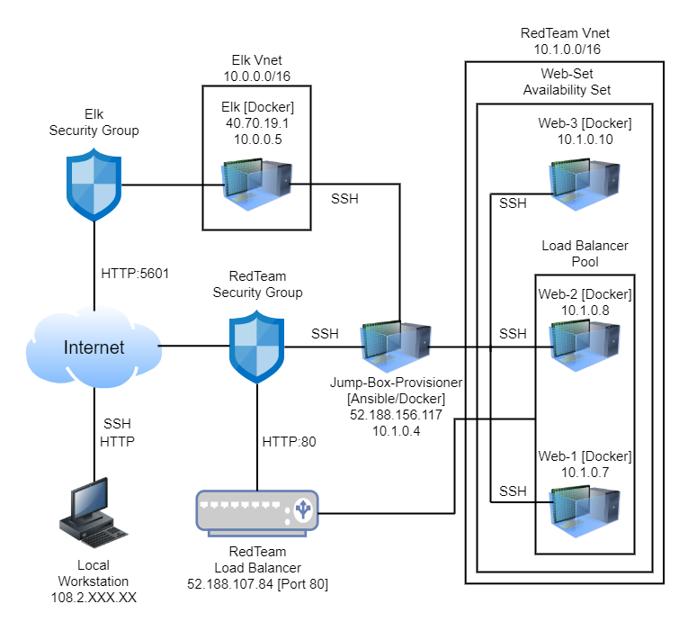
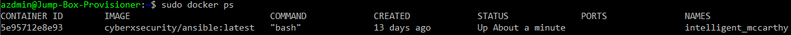

# ELK_Stack_Project
In this project I set up a cloud monitoring system by configuring an ELK stack server.

## Automated ELK Stack Deployment

The files in this repository were used to configure the network depicted below.



These files have been tested and used to generate a live ELK deployment on Azure. They can be used to recreate the entire deployment pictured above. Alternatively, select portions of the playbook files may be used to install certain pieces of it, such as Filebeat.

```yml
---
- name: Installing and launching filebeat
  hosts: elk
  become: yes
  tasks:

    # Use command module
  - name: Download filebeat deb
    command: curl -L -O https://artifacts.elastic.co/downloads/beats/filebeat/filebeat-7.6.1-amd64.deb

    # Use command module
  - name: Install filebeat deb
    command: dpkg -i filebeat-7.6.1-amd64.deb

    # Use copy module
  - name: Drop in filebeat.yml
    copy:
      src: /etc/ansible/files/filebeat-config.yml
      dest: /etc/filebeat/filebeat.yml
 
    # Use command module
  - name: Enable and configure system module
    command: filebeat modules enable logstash

    # Use command module
  - name: Setup filebeat
    command: filebeat setup

    # Use command module
  - name: Start filebeat service
    command: sudo service filebeat start
```

This document contains the following details:
- Description of the Topology
- Access Policies
- ELK Configuration
  - Beats in Use
  - Machines Being Monitored
- How to Use the Ansible Build

### Description of the Topology

The main purpose of this network is to expose a load-balanced and monitored instance of DVWA, the Damn Vulnerable Web Application.

Load balancing ensures that the application will be highly available, in addition to restricting traffic to the network.
- _What aspect of security do load balancers protect? A load balancer protects against Distributed Denial-of-Service (DDoS) attacks._
- _What is the advantage of a jump box? Jump Servers have many advantages. The ability to create built-in identity and access managenment._

Integrating an ELK server allows users to easily monitor the vulnerable VMs for changes to the logs and system traffic.
- _What does Filebeat watch for? Filebeat watches and collects data about the file system._
- _What does Metricbeat record? Metricbeat records and collects machine metrics._

The configuration details of each machine may be found below.
_Note: Use the [Markdown Table Generator](http://www.tablesgenerator.com/markdown_tables) to add/remove values from the table._

| Name            | Function     | IP Address     | Operating System |
|-----------------|--------------|----------------|------------------|
| Jump-Box        | Gateway      | 52.188.156.117 | Linux            |
| Web-1           | UbuntuServer | 10.1.0.7       | Linux            |
| Web-2           | UbuntuServer | 10.1.0.8       | Linux            |
| Web-3           | UbuntuServer | 10.1.0.10      | Linux            |  
| Elk             | UbuntuServer | 10.0.0.5       | Linux            |
| RT-LoadBalancer | LoadBalancer | 52.188.107.84  |                  |

### Access Policies

The machines on the internal network are not exposed to the public Internet. 

Only the Jump-Box machine can accept connections from the Internet. Access to this machine is only allowed from the following IP addresses:
- _108.2.103.24_

Machines within the network can only be accessed by SSH.
- _Which machine did you allow to access your ELK VM? Jump-Box-Provisioner._ 
- _What was its IP address? 52.118.156.117_

A summary of the access policies in place can be found in the table below.

| Name                | Publicly Accessible | Allowed IP Addresses                 |
|---------------------|---------------------|--------------------------------------|
| Jump-Box-Provisoner | Yes                 | 10.1.0.7 10.1.0.8 10.1.0.10 10.0.0.5 |
| Web-1               | No                  | 10.1.0.4                             |
| Web-2               | No                  | 10.1.0.4                             |
| Web-3               | No                  | 10.1.0.4                             |
| ELK                 | No                  | 10.1.0.4                             |

### Elk Configuration

Ansible was used to automate configuration of the ELK machine. No configuration was performed manually, which is advantageous because...
- _What is the main advantage of automating configuration with Ansible? The main advantage of automating with Ansible is you create consistent, high-scale reproducable results throughout multiple machine configurations._

The playbook implements the following tasks:
- _Explain the steps of the ELK installation play. E.g., install Docker; download image; etc._
    - Install docker.io
    - Install python3.pip
    - Install docker module
    - Increase virtual memory
    - Use more memory
    - Download and lauch a docker elk container via specific ports
       - 5601:5601
       - 9200:9200
       - 5044:5044

The following screenshot displays the result of running `docker ps` after successfully configuring the ELK instance.

'''
CONTAINER ID        IMAGE                           COMMAND             CREATED             STATUS                   PORTS               NAMES
5e95712e8e93        cyberxsecurity/ansible:latest   "bash"              13 days ago         Up 40 minutes                                intelligent_mccarthy
'''



### Target Machines & Beats
_This ELK server is configured to monitor the following machines:_
  - Web-1: 10.1.0.7
  - Web-2: 10.1.0.8
  - Web-3: 10.1.0.10

_We have installed the following Beats on these machines:_
  - Web-1: 10.1.0.7
  - Web-2: 10.1.0.8
  - Web-3: 10.1.0.10

These Beats allow us to collect the following information from each machine:
- _In 1-2 sentences, explain what kind of data each beat collects, and provide 1 example of what you expect to see._
    - Filebeat: Filebeat monitors the log files or locations that you specify. An example would be Kibana.
    - Metricbeat: Metricbeat monitors the metrics and statistics of the system. An example would be Apache.

### Using the Playbook
In order to use the playbook, you will need to have an Ansible control node already configured. Assuming you have such a control node provisioned: 

SSH into the control node and follow the steps below:
- Copy the .yml file to the ansible directory.
- Update the config file to include remote users, host ip address and port range.  
- Run the playbook, and navigate to Kibana website to check that the installation worked as expected.

_Answer the following questions to fill in the blanks:_
 - Which file is the playbook? .yml file
 - Where do you copy it? /etc/ansible
 - Which files do you update to make Ansible run the playbook on a specific machine? /etc/ansible/hosts and /etc/ansible/ansible.cfg 
 - How do I specify which machine to install the ELK server on versus which to install Filebeat on? Editing the /etc/ansible/hosts file with the approriate ip addresses.
 - Which URL do you navigate to in order to check that the ELK server is running? http://40.70.19.1:5601/app/kibana#/home

_As a **Bonus**, provide the specific commands the user will need to run to download the playbook, update the files, etc._
